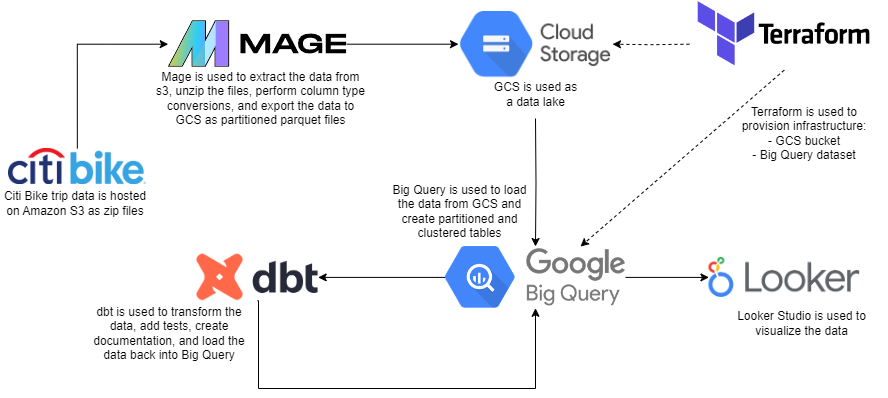
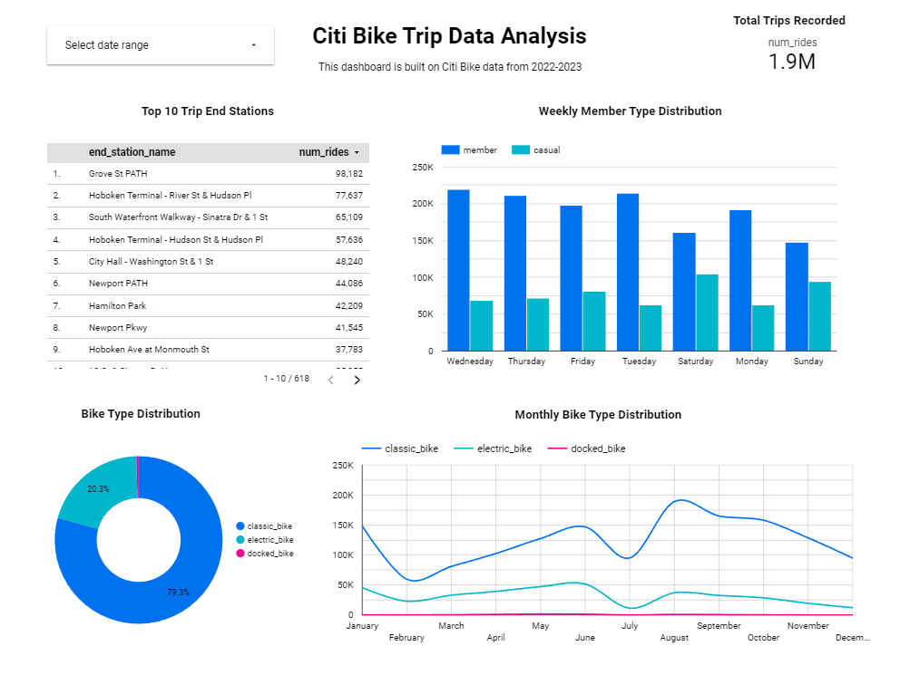

# Citi Bike Trip Data Pipeline

This is my submission for [Data Engineering Zoomcamp 2024](https://github.com/DataTalksClub/data-engineering-zoomcamp) final project.

## Problem Description

Citi Bike is a public bicycle sharing system serving  New York City. In this project I have created a pipeline for Citi Bike trip data between `Jan 2022` and `Dec 2023` to answer the following questions:

- What are the top destinations for Citi Bikers?
- What days of the week are most rides taken on?
- What are the different types of bikes available?
- What does bike use look like month over month?
- What are the total number of trips recorded during this period?

## Data

This data used in this project is extracted from [Citi Bike Trip Data](https://citibikenyc.com/system-data).

The data includes the following fields:
- Ride ID
- Rideable type
- Started at
- Ended at
- Start station name
- Start station ID
- End station name
- End station ID
- Start latitude
- Start longitude
- End latitude
- End Longitude
- Member or casual ride

## Technologies Used

- **Docker** (containerization)
- **Terraform** (infrastructure as code)
- **Mage** (workflow orchestration)
- **Google Cloud Storage** (data lake)
- **BigQuery** (data warehouse)
- **dbt** (data transformation)
- **Looker Studio** (data visualization)

## Data Pipeline

## Data Visualization

View the Looker Studio dashboard [here](https://lookerstudio.google.com/reporting/57b3e010-5c75-4286-81b0-220995285811).

## Reproduce Project

To reproduce the project and test the code yourself, follow these [instructions](docs/reproduce.md).