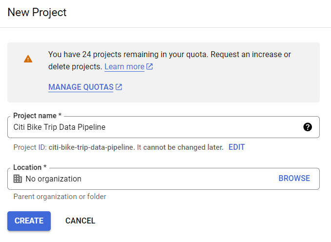
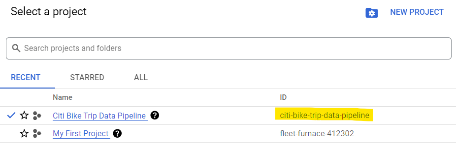
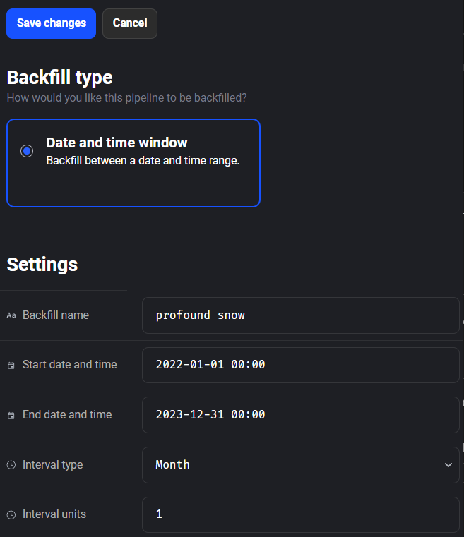
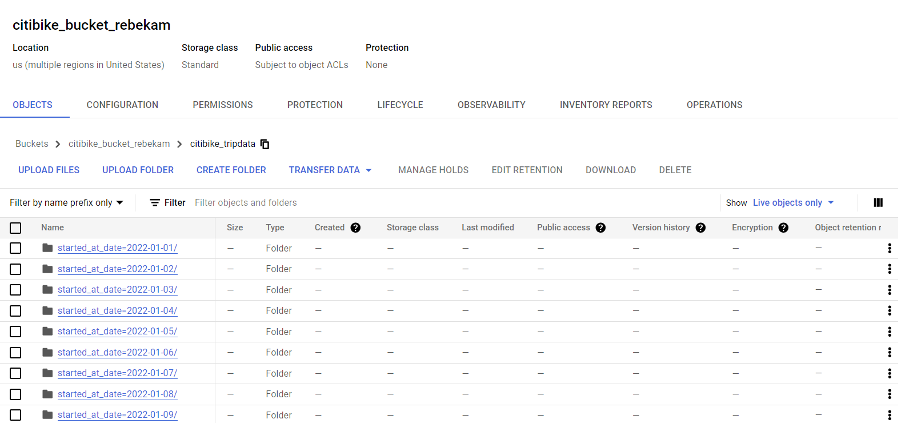
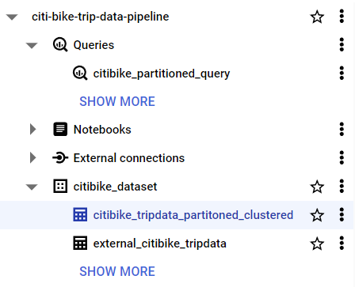
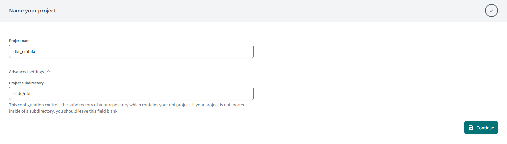
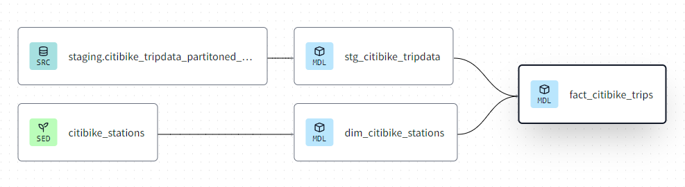
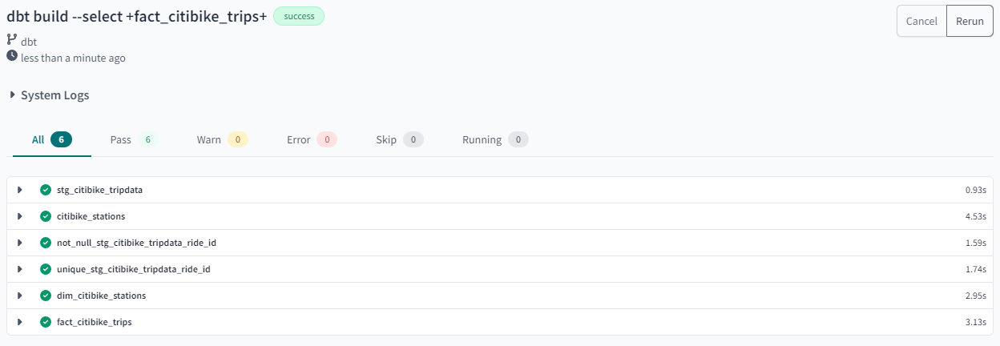
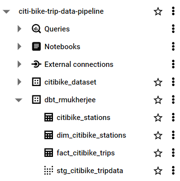

# Reproduce

## Create New GCP Project

Navigate to [Google Cloud Platform](https://console.cloud.google.com/) and create a new project by clicking on the dropdown button next to the current project name, and then clicking on **NEW PROJECT**.



Make sure that that new project is selected from the dropdown.


## Create Service Account

To setup a Service Account, navigate to **IAM & Admin** > **Service Accounts** from the left hamburger menu. Then click on the **CREATE SERVICE ACCOUNT** button at the top of the screen. Create a service account called `citibike`. Then add the following roles to grant this service account access to project and then click **Done**:
- BigQuery Admin
- Storage Admin

Next, click on the ellipse next to the newly created service account, and select **Manage keys**. Click on **ADD KEY** > **Create new key** > select **JSON** key type > **CREATE**. A key will be downloaded to our machine.

1. Navigate to the terraform directory
    ```bash
    cd code/terraform
    ```
2. Create a subfolder `keys/` in the terraform directory
    ```bash
    mkdir keys
    ```
3. Save the key in the `keys/` subfolder in a file called `creds.json`

> Make sure the subfolder `keys/` is added to `.gitignore`

## Setup Infrastructure with Terraform

### Get the Terraform provider for GCP

Terraform client installation: https://www.terraform.io/downloads

1. Download Terraform.
2. From the download, extract the executable to a directory of your choosing (for example, c:\terraform).
3. Update your system's global path to the executable.
4. Open a terminal window.
5. Verify the global path configuration with the terraform command `terraform -version`

Install the **HashiCorp Terraform** extension in VSCode.

### Run Terraform Code

Make the following changes in the file `code\terraform\variables.tf`:
- Change the **project name** to match your GCP project name

- Change the **Google Cloud Storage bucket name**. <u>It must be a unique value!</u>
- (optional) Change the **Big Query dataset name**
- (optional) Change the **region** and **location** depending on where you are located

1. Navigate to the terraform directory
    ```bash
    cd code/terraform
    ```
2. Get the terraform provider for GCP
    ```bash
    terraform init
    ```
3. View the terraform plan
    ```bash
    terraform plan
    ```
4. Create the resources
    ```bash
    terraform apply
    ```
    - When it asks to **"Enter a value:"** to continue, enter `yes`

Check GCP to see if the resources were created.

## Load data to Google Cloud Storage with Mage.ai

### Configure Mage

Start by cloning the [mage-zoomcamp](https://github.com/mage-ai/mage-zoomcamp) repo by running the following command: `git clone https://github.com/mage-ai/mage-zoomcamp.git mage-zoomcamp`

- I copied the contents of the repo to a folder called `code/mage`
- Rename `dev.env` to simply `.env`. This will ensure the file is not committed to Git by accident, since it will contain credentials in the future
- In the `.env` file, change the name of the project to `mage-citibike`
- Copy `creds.json` from `code/terraform/keys/` into `code/mage/keys`

> Make sure the subfolder `keys/` is added to `.gitignore`

1. Navigate to the mage directory
    ```bash
    cd code\mage
    ```
2. Build the docker container
    ```bash
    docker compose build
    ```
3. Start the docker container
    ```bash
    docker compose up
    ```
4. Navigate to http://localhost:6789 in the browser

We just initialized a new mage repository. It will be present in the project under the name `mage-citibike`.

### ETL: API to GCS

Create a new *Batch* **pipeline** and rename it to `api_to_gcs`

Create a *Python API* **data loader** called `load_api_data` and replace the template code with the following:

```python
import io
import pandas as pd
import requests
from zipfile import ZipFile
if 'data_loader' not in globals():
    from mage_ai.data_preparation.decorators import data_loader
if 'test' not in globals():
    from mage_ai.data_preparation.decorators import test


@data_loader
def load_data_from_api(*args, **kwargs):

    # define data types of the fields in the data
    citibike_dtypes = {
        'ride_id':str,
        'rideable_type':str,
        'start_station_name':str,
        'start_station_id':str,
        'end_station_name':str,
        'end_station_id':str,
        'start_lat':float,
        'start_lng':float,
        'end_lat':float,
        'end_lng':float,
        'member_casual':str,
    }

    # identify fields that are dates
    parse_dates = ['started_at', 'ended_at']

    # configure the URL using year and month
    year = kwargs['execution_date'].year
    month = kwargs['execution_date'].month
    if month < 10:
        month = '0' + str(month)
    else:
        month = str(month)
    url = f'https://s3.amazonaws.com/tripdata/JC-{year}{month}-citibike-tripdata.csv.zip'
    
    # read the ZIP file from the URL
    response = requests.get(url)
    if response.status_code != 200:
        raise Exception(f"Failed to download ZIP file from {url}")

    with ZipFile(io.BytesIO(response.content)) as zip_file:
        # get the list of files inside the ZIP archive
        file_list = zip_file.namelist()
        
        # filter out the desired CSV files
        csv_files = [file_name for file_name in file_list if file_name.endswith('.csv') and '/' not in file_name]
        if len(csv_files) == 0:
            raise ValueError("Expected one CSV file inside the ZIP archive.")
        
        # read the CSV files and concatenate multiple files
        data = []
        for csv_file in csv_files:
            with zip_file.open(csv_file) as file:
                data.append(pd.read_csv(file, sep=',', dtype=citibike_dtypes, parse_dates=parse_dates))
        data = pd.concat(data)
        print (f'Shape of the data: {data.shape}')

        return data


@test
def test_output(output, *args) -> None:

    assert output is not None, 'The output is undefined'
```

Next, create a *Generic Python* **transformer** called `transform_data` and replace the template code with the following:

```python
if 'transformer' not in globals():
    from mage_ai.data_preparation.decorators import transformer
if 'test' not in globals():
    from mage_ai.data_preparation.decorators import test


@transformer
def transform(data, *args, **kwargs):

    # create a new column started_at_date by converting started_at to a date
    data['started_at_date'] = data['started_at'].dt.date

    # create a new column ended_at_date by converting ended_at to a date
    data['ended_at_date'] = data['ended_at'].dt.date

    return data


@test
def test_output(output, *args) -> None:

    assert output is not None, 'The output is undefined'
```

Next, Create a *Python Google Cloud Storage* **data exporter** called `export_gcs_paritioned` and replace the template code with the following:

```python
import pyarrow as pa
import pyarrow.parquet as pq
import os

if 'data_exporter' not in globals():
    from mage_ai.data_preparation.decorators import data_exporter

os.environ['GOOGLE_APPLICATION_CREDENTIALS'] = "/home/src/keys/creds.json"
project_id = 'citi-bike-trip-data-pipeline'
bucket_name = 'citibike_bucket_rebekam'
table_name = 'citibike_tripdata'
root_path = f'{bucket_name}/{table_name}'


@data_exporter
def export_data_to_google_cloud_storage(data, *args, **kwargs):
    table = pa.Table.from_pandas(data)
    gcs = pa.fs.GcsFileSystem()
    pq.write_to_dataset(
        table,
        root_path=root_path,
        partition_cols=['started_at_date'],
        filesystem=gcs
    )
```

Finally, in the Mage console navigate to **Backfills** from the left menu. Create a new backfill with the following details and save changes. Then click on **Start backfill**.



Once all the pipelines have run, check GCS bucket to see if the paritioned files have loaded.



To exit the container run `Ctrl+C` in the command prompt followed by `docker compose down`.

## Data Warehousing in BigQuery

In the Google Cloud Platform console, navigate to BigQuery and run the following SQL code:

```sql
-- create external table referring to gcs path
CREATE OR REPLACE EXTERNAL TABLE `citi-bike-trip-data-pipeline.citibike_dataset.external_citibike_tripdata`
OPTIONS (
  format = 'PARQUET',
  uris = ['gs://citibike_bucket_rebekam/citibike_tripdata/started_at_date=*/6fc6de18e20e49b885909902912ba6a8-0.parquet']
);

-- create a partition and cluster table from external table
CREATE OR REPLACE TABLE `citi-bike-trip-data-pipeline.citibike_dataset.citibike_tripdata_partitoned_clustered`
PARTITION BY started_at_date
CLUSTER BY start_station_name AS
SELECT *,
DATE(TIMESTAMP_MICROS(CAST (started_at/1000 AS INT64))) AS started_at_date
FROM `citi-bike-trip-data-pipeline.citibike_dataset.external_citibike_tripdata`;
```
- Change the project name to match your project name
- Change the GCS bucket name to match your bucket name
- Make sure the URI is correct



## Transformation with dbt

### Create a dbt cloud project

Create a dbt user account by going to [dbt homepage](https://www.getdbt.com/) and signing up for a free account.

Non-enterprise account can have only one project. Navigate to **Account** > **Projects** to delete any old project. Now we can go to the homepage to setup a new project.



Choose **BigQuery** as the data warehouse.
- Upload the service account key json file in the create from file option. This will fill out most fields related to the production credentials.
- Scroll down to the end of the page and set up the development credentials.
- Click on **Test Connection** > **Next**.

Finally, add this GitHub repository. Navigate to **Account** > **Projects** to specify the project subdirectory which is `code/dbt`.

Navigate to **Develop** tab on the top to view the project.

dbt does not allow us to work on the main branch after this, hence we need to create a new branch.

### Build the dbt project

Open the file `code\dbt\models\core\fact_citibike_trips.sql` in the dbt console. If we click on the **Lineage** tab in the bottom, we should see this diagram:



To build the project run:
```bash
dbt build --select +fact_citibike_trips+
```



dbt docs can be generated on the cloud or locally with `dbt docs generate`, and can be hosted in dbt Cloud as well or on any other webserver by running `dbt docs serve`

Now, if we navigate to BigQuery we will be able to see the tables created by dbt.



## Visualize with Looker Studio

TODO: 2 slides to visualize the data


## Teardown resources

1. Navigate to the terraform directory
    ```bash
    cd code/terraform
    ```
2. Destroy resources created by terraform
    ```bash
    terraform destroy
    ```
3. Delete GCP service account(s)
4. Delete GCP project